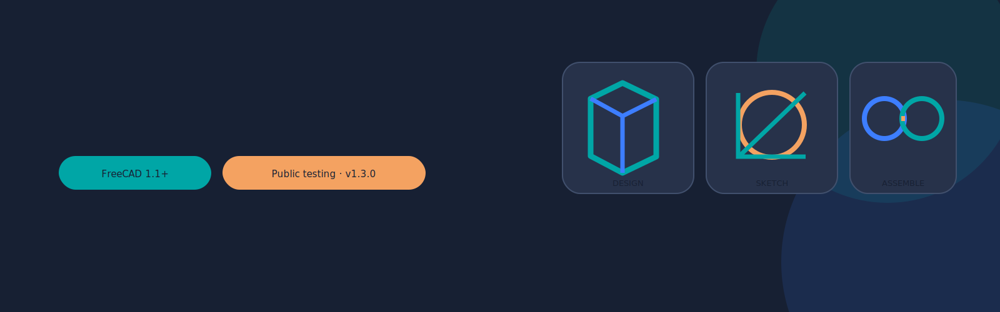

<p align="center">
  
</p>

<p align="center">
  
  
  
  
</p>

# Fusion-like FreeCAD Workflow Profile

A reversible FreeCAD workflow layer that reorganizes native Part Design, Sketcher, TechDraw, and Assembly tools into a more Fusion-familiar interface. It also adds persistent projection helpers, threaded-hole and independent-thread workflows, guided drawing insertion, assembly component copy/paste, and verbose mate diagnostics.

> **Public-test status:** version 1.3.0 has passed static packaging and syntax checks, but this repository does not claim full live-GUI validation across every FreeCAD, operating-system, Qt, and Open CASCADE combination. Test on copies of important models and report reproducible issues.

This project is independent. It is not affiliated with Autodesk or the FreeCAD project, and it includes no Autodesk assets.

## Quick installation

1. Download `Install_FusionLike_FreeCAD_v1.3.0.FCMacro` from `macros/` or the release ZIP in `dist/`.
2. In FreeCAD, open **Macro → Macros…** and note the **User macros location**.
3. Copy the installer macro there, select it in the Macro dialog, and click **Execute**.
4. Confirm that the **Fusion-like** menu and workspace selector appear.
5. Run `FusionLikeUI_SmokeTest_v1.3.0.FCMacro` for a non-destructive installation check.

Upgrading from v1.0-v1.2 is in-place. Do **not** uninstall first; the original-interface backup is retained.

[Full installation and rollback guide →](docs/INSTALLATION.md)

## What it provides

| Area | Main functions |
|---|---|
| Interface | Fusion-like workspace selector, contextual ribbons, left model browser, task panel, command search, and bottom feature timeline |
| Sketch | Contextual primitive/constraint tools, linked face/edge/sketch projection, construction references, intersections, and direct transition to Pad/Pocket |
| Threads | Native threaded-hole dialog plus a persistent independent modeled/cosmetic cylindrical thread feature |
| Drawing | Guided dimensionable model-view insertion, projected views, dimension selection checks, thread callouts, BOM placement, and PDF/SVG/DXF output |
| Assembly | Add Selected, component copy/paste/duplicate, native joints, grounding, solver inspection, live mate diagnostics, and decoded failure reports |
| Safety | Original-layout capture, reversible profile state, uninstall macro, FreeCAD transactions, and explicit Report-view logging |

<p align="center">
  
</p>

## Three workflows to learn first

### 1. Sketch and project geometry

Open a sketch, press **P**, and select a face, edge, vertex, or earlier sketch. The projected geometry is linked and can define a Pad or Pocket. Use **Shift+P** for construction/reference geometry.

[Sketch and projection guide →](docs/USER_GUIDE.md#sketch-and-project--include)

### 2. Create a dimensionable drawing

Use **DRAWING → Insert Model View**. Do not use **Active View Snapshot** for normal dimensions; it is a raster capture with no associative drawing edges.

[Drawing guide →](docs/USER_GUIDE.md#drawing-workspace)

### 3. Build and diagnose an assembly

Use **Add Selected** or the component clipboard, ground one component, choose connector geometry on two different instances, and create a native joint. Use **Why won’t this mate?** or **Solve and show diagnostics** when the solver rejects the graph.

[Assembly guide →](docs/USER_GUIDE.md#assembly-workspace)

## Documentation

- [Graphical user guide](docs/USER_GUIDE.md)
- [Ten-minute quick start](docs/QUICK_START.md)
- [Install, setup, upgrade, restore, and uninstall](docs/INSTALLATION.md)
- [User-facing feature reference](docs/FEATURE_REFERENCE.md)
- [Developer function reference](docs/DEVELOPER_FUNCTION_REFERENCE.md)
- [Architecture and extension points](docs/ARCHITECTURE.md)
- [Testing matrix](docs/TESTING.md)
- [Troubleshooting](docs/TROUBLESHOOTING.md)
- [Known limitations](docs/KNOWN_LIMITATIONS.md)
- [GitHub publishing and release guide](docs/GITHUB_RELEASE.md)
- [Offline PDF guide](docs/FusionLikeUI_User_Guide.pdf)

## Repository layout

```text
src/                     Runtime source of truth
macros/                  Installer, uninstaller, and smoke-test macros
installer/               Reproducible installer template
packaging/               Startup files and installed README
release/                 Plain-text release notes and validation report
dist/                    Generated public-test release ZIP and checksums
docs/                    User, tester, and developer documentation
tools/                   Static validation and deterministic release builder
.github/                 Issue forms, pull-request template, and CI workflow
```

## Public testing

Before opening an issue, run the smoke test and reproduce the problem in a minimal document. Include:

- FreeCAD version from **Help → About FreeCAD → Copy to clipboard**
- operating system and Qt version if known
- exact command sequence
- selected objects and subelements
- whether the document links external component files
- all relevant `[Fusion-like UI]` lines from **View → Panels → Report view**

[Open the testing checklist →](docs/TESTING.md)

## Build and validate

The repository tooling uses only Python’s standard library:

```bash
python tools/validate_package.py --repo .
python tools/build_release.py --repo . --check
```

To regenerate the release artifacts:

```bash
python tools/build_release.py --repo .
```

## Important limitations

FreeCAD and Autodesk Fusion use different kernels, object models, history graphs, assembly solvers, and drawing systems. This project aims for workflow familiarity, not implementation identity. Topological changes can invalidate face/edge references, modeled threads can be computationally expensive, and nonlinear assembly diagnostics cannot prove that every apparently compatible mate will solve.

See [Known limitations](docs/KNOWN_LIMITATIONS.md) before using the profile in production work.

## Contributing

Bug reports, compatibility results, documentation corrections, and focused pull requests are welcome. Read [CONTRIBUTING.md](CONTRIBUTING.md) first. Do not submit copied Autodesk assets or proprietary content.

## License

GNU Lesser General Public License, version 2.1 or later. See [LICENSE](LICENSE) and [THIRD_PARTY_NOTICES.md](THIRD_PARTY_NOTICES.md).
