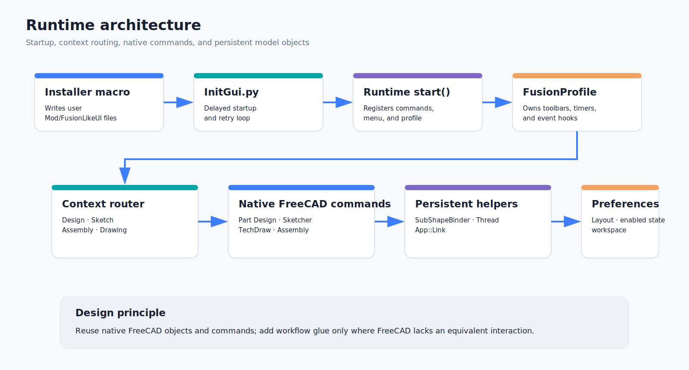

# Architecture and extension points

## Boot sequence

1. The installer writes `Init.py`, `InitGui.py`, the runtime, and an installed README under the FreeCAD user `Mod/FusionLikeUI` directory.
2. `InitGui.py` schedules a delayed boot and retries while the main window is unavailable.
3. `fusion_like_ui_runtime.start()` registers custom commands, installs the persistent menu, creates a `FusionProfile`, and applies it when enabled.
4. `FusionProfile.apply()` captures original state once, configures navigation, activates Part Design when available, and finishes UI creation asynchronously.
5. A timer monitors document/workbench/edit context and rebuilds the ribbon when Design, Sketch, Assembly, or Drawing context changes.

## Main runtime components

### `FusionProfile`

Central controller for:

- original-state capture and restoration
- toolbar/dock construction
- workspace switching and context routing
- command palette and shortcuts
- timeline and Body-Tip control
- Hole and Thread dialogs
- projection sessions and binder management
- Drawing view insertion/dimension validation/export
- Assembly clipboard, guided joints, live diagnostics, and solver reports

### Dialog and command classes

- `HoleThreadDialog`: edits a native Hole through a reorganized Qt form.
- `StandaloneThreadDialog`: gathers independent Thread settings.
- `FusionThreadFeatureProxy`: recomputes persistent thread geometry.
- `NativeThreadCatalog`: queries FreeCAD’s native thread tables through a temporary Hole object.
- `DrawingSourceDialog`: chooses source objects and target TechDraw page.
- `CommandPalette`: indexes and runs registered `QAction` objects.
- `FusionHoleCommand` / `FusionThreadCommand`: register the custom FreeCAD commands.

## Native objects used

| Workflow | Native/custom object |
|---|---|
| Parametric solid history | `PartDesign::Body`, native Part Design features |
| Sketch | `Sketcher::SketchObject` |
| Cross-body projection | `PartDesign::SubShapeBinder` |
| Threaded hole | native `PartDesign::Hole` |
| Independent thread | `PartDesign::FeaturePython` with `FusionThreadFeatureProxy` |
| Assembly components | `App::Link`; `Assembly::AssemblyLink` where supported |
| Assembly and joints | native Assembly objects and Python joint proxies |
| Drawing model view | `TechDraw::DrawViewPart` / projection-group workflow |
| Active View snapshot | `TechDraw::DrawViewImage` |
| Thread callout | TechDraw annotation linked to source feature |

## State and preferences

The profile uses FreeCAD parameter groups rather than external configuration files:

- `User parameter:BaseApp/Preferences/FusionLike`
- `User parameter:BaseApp/Preferences/View`
- `User parameter:BaseApp/Preferences/Mod/Sketcher/General`

Original state is captured only once unless preferences are deliberately reset. Qt main-window state is serialized as Base64.

## UI context routing

The active workbench alone is insufficient because FreeCAD can edit a Sketch while Part Design remains active. The context signature therefore includes:

- active workbench
- active edited Sketch identity
- command/action availability
- active document context

The timer rebuilds only when the signature changes.

## Projection dependency strategy

1. Normalize Body-display selections to the actual source feature.
2. Expand whole-object selections into shape subelements when required.
3. Reject self-reference, later same-Body features, and circular dependencies.
4. Use direct Sketch external geometry when allowed.
5. Otherwise create/reuse a synchronized SubShapeBinder before the destination Sketch.
6. Add external defining or reference geometry and recompute in a transaction.

## Independent thread strategy

The proxy stores source feature/face references plus standard, size, class, pitch, nominal diameter, direction, extent, offset, and clearance. On recompute it analyzes cylindrical faces, builds a helical cutter, applies the boolean operation, and writes callout metadata. Cosmetic mode retains metadata without generating the helical cut.

## Assembly diagnostic strategy

- Preflight reads current selections and classifies connector geometry.
- A guarded monkey patch adds a diagnostic panel to the native task and reports rejected selections.
- Post-accept logic calls the native solver and decodes numeric status.
- The original native task methods are restored when the profile is removed.

## Drawing strategy

The profile intentionally separates raster captures from model-linked views. Insert Model View selects source objects and a page, then routes through the native TechDraw model-view/projected-view command. Dimension commands are wrapped with selection diagnostics but remain native TechDraw operations.

## Extension guidelines

New features should:

1. prefer native FreeCAD commands and objects
2. preserve undo transactions
3. avoid persistent event hooks without a matching removal path
4. remain reversible through `restore()`
5. protect text-input and modal-dialog keyboard focus
6. provide compatibility fallback command IDs
7. write actionable errors to Report view with the `[Fusion-like UI]` prefix
8. avoid Autodesk assets and implementation claims
