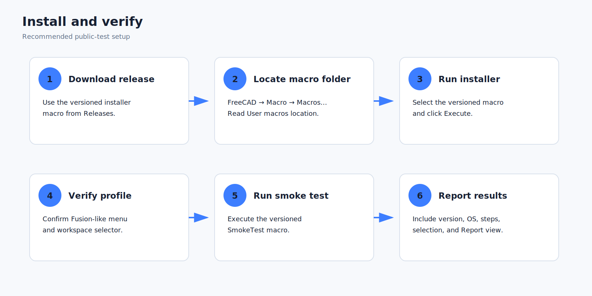

# Installation and setup guide

<p align="center"></p>

## Requirements

- FreeCAD **1.1 or newer** with the standard Part Design, Sketcher, TechDraw, and Assembly modules available.
- Permission to write to your FreeCAD user-data directory.
- A backup of important `.FCStd` documents before public-testing a new build.

The installer checks the FreeCAD version before writing the add-on. Use FreeCAD’s own **Macro → Macros…** dialog to locate the macro directory; this is more reliable than hard-coded operating-system paths.

## Recommended installation

1. Close active Sketch, Hole, Thread, Drawing, or Assembly task dialogs.
2. Download `macros/Install_FusionLike_FreeCAD_v1.3.0.FCMacro`.
3. Open FreeCAD.
4. Choose **Macro → Macros…**.
5. Read the **User macros location** shown in the dialog.
6. Copy the installer macro into that directory.
7. Return to the Macro dialog, select the installer, and click **Execute**.
8. Confirm the installation message.
9. Verify that a **Fusion-like** menu appears and that the top workspace selector contains **DESIGN**, **ASSEMBLE**, and **DRAWING** when those native workbenches are present.

Restarting is normally unnecessary. Restart once when upgrading from a runtime that has been loaded for a long session, or when an old native task dialog remains open after installation.

## What the installer writes

The installer creates this user module:

```text
<FreeCAD user data>/Mod/FusionLikeUI/
├── Init.py
├── InitGui.py
├── fusion_like_ui_runtime.py
└── README.txt
```

`InitGui.py` waits for the FreeCAD main window, imports the runtime, and retries startup if the GUI is not ready yet.

The installer also stores profile state under:

```text
User parameter:BaseApp/Preferences/FusionLike
```

That state includes whether the profile is enabled, the installed version, the original workbench/layout state, and selected workflow preferences.

## Upgrade from v1.0-v1.2

Run the v1.3 installer directly over the earlier version.

- Do **not** run the uninstaller first.
- The original interface backup captured during the first installation is preserved.
- The loaded older runtime is asked to restore and remove its event hooks before replacement.
- Existing modeled documents are not rewritten by the installer.

## Verify the installation

Run `macros/FusionLikeUI_SmokeTest_v1.3.0.FCMacro` through **Macro → Macros…**.

The smoke test checks:

- installed version and runtime path
- required public runtime functions
- availability of key FreeCAD commands currently registered
- profile preference state

Workbench-specific commands can appear unavailable until the corresponding native workbench has been activated once. Activate Part Design, Sketcher, Assembly, and TechDraw, then rerun the smoke test if needed.

## Manual source-tree installation

This method is intended for developers.

1. Create `<FreeCAD user data>/Mod/FusionLikeUI/`.
2. Copy `packaging/Init.py` and `packaging/InitGui.py` into it.
3. Copy `src/fusion_like_ui_runtime.py` into it with that exact filename.
4. Copy `packaging/installed_README.txt` as `README.txt`.
5. Restart FreeCAD.

The release installer is preferred for testers because it also handles original-state capture, loaded-runtime replacement, version checking, and immediate activation.

## First-run setup

1. Start in **DESIGN** and confirm middle-mouse pan, Shift+middle-mouse orbit, and mouse-wheel zoom.
2. Create or edit a Sketch and confirm that the ribbon changes to Sketch tools.
3. Open **DRAWING** once so TechDraw registers its actions.
4. Open **ASSEMBLE** once so the Assembly actions and diagnostic wrappers are registered.
5. Run the smoke test.

## Restore without uninstalling

Choose:

```text
Fusion-like → Restore original FreeCAD interface
```

This disables the profile, removes its runtime widgets and event filters, restores saved navigation preferences, reactivates the original workbench when available, and restores the saved Qt window state.

To re-enable it later, choose:

```text
Fusion-like → Apply / rebuild Fusion-like profile
```

## Uninstall

1. Close active task dialogs.
2. Run `macros/Uninstall_FusionLike_FreeCAD_v1.3.0.FCMacro`.
3. Restart FreeCAD once.

The uninstaller attempts to restore the original interface before removing the user module.

## Installation troubleshooting

### Installer reports that FreeCAD is too old

Install FreeCAD 1.1 or newer. The runtime depends on APIs and commands not consistently available in earlier releases.

### Nothing appears after installation

Open **View → Panels → Report view** and look for messages prefixed `[Fusion-like UI]`. Restart FreeCAD once, then rerun the smoke test.

### Some toolbar buttons are missing

Activate the corresponding native workbench once. FreeCAD registers some actions lazily.

### The interface is duplicated

Choose **Fusion-like → Apply / rebuild Fusion-like profile**. The rebuild removes existing profile toolbars before recreating them.

### The original layout is not restored exactly

Qt layout state can differ when dock widgets or workbenches have changed between FreeCAD builds. Use FreeCAD’s native **View → Panels** and **View → Toolbars** menus to make final adjustments, then report the build and steps used.
