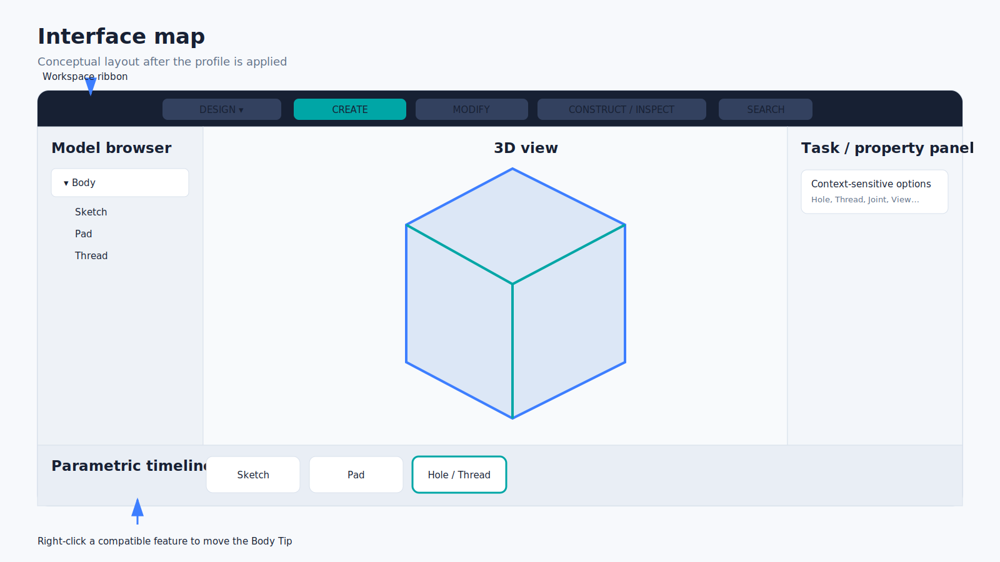
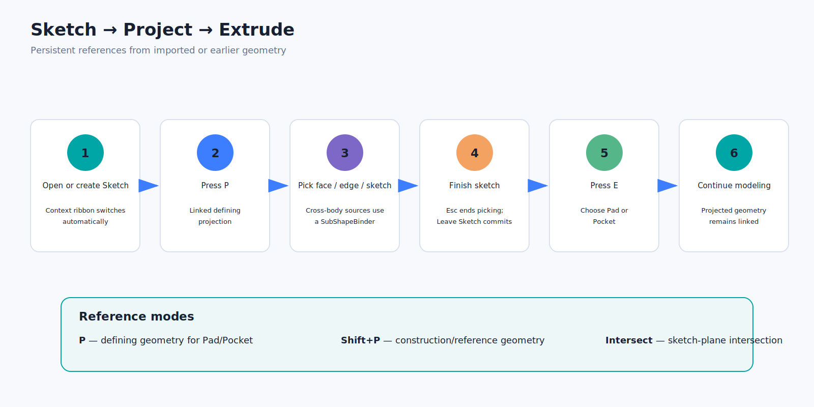
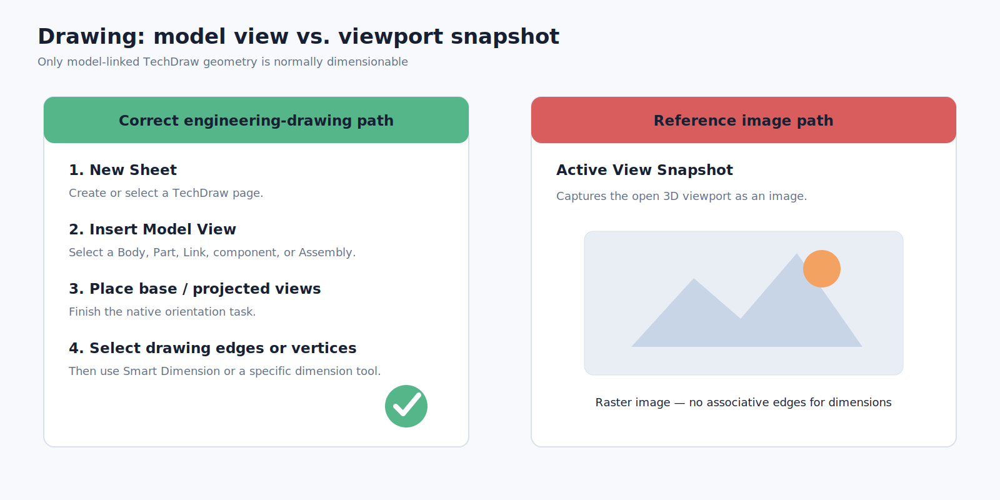
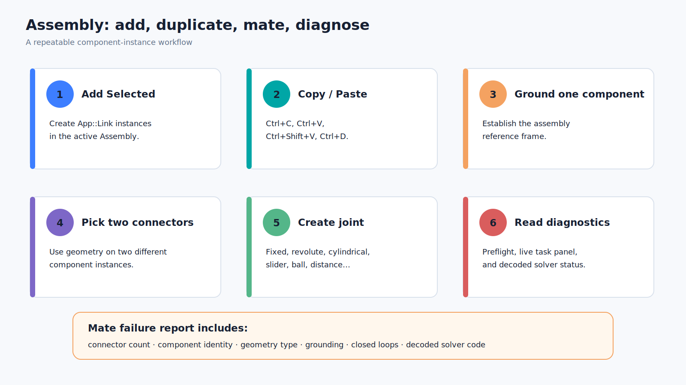

# Ten-minute quick start

This walkthrough confirms the major workflows without requiring a production model.

## 1. Confirm the interface

Choose **DESIGN** in the workspace selector. You should see Create, Modify, and Construct/Inspect groups, a model browser on the left, a task/property area, and the feature timeline along the bottom.

## 2. Create a sketch and solid

1. Create a new document.
2. Create a Part Design Body.
3. Start a Sketch on the XY plane.
4. Confirm that the ribbon changes to Sketch primitives and constraints.
5. Draw a rectangle with **R**.
6. Leave the Sketch.
7. Press **E** and choose **Add / Pad**.

## 3. Project a face and cut it

1. Select a face of the Pad and create another Sketch on it.
2. Press **P**.
3. Click an outer edge or a suitable face boundary.
4. Press **Esc** to end projection picking.
5. Add any additional sketch geometry required for a closed profile.
6. Press **E** and choose **Cut / Pocket**.

## 4. Try a threaded hole

1. Create a Sketch containing a point or circle where the hole should be placed.
2. Select the Sketch.
3. Press **H**.
4. Choose **Hole & Thread**.
5. Select a standard and size.
6. Use cosmetic representation for a fast test, or modeled representation for physical helical geometry.

## 5. Create a dimensionable drawing

1. Choose **DRAWING**.
2. Click **Insert Model View**.
3. Select the Body as the source and create a new default sheet.
4. Complete the base/projected-view task.
5. On the drawing page, select an actual projected edge or vertex.
6. Use **Smart Dimension**.

Do not use **Active View Snapshot** for this test; it creates a raster image.

## 6. Create a small assembly

1. Save the document or open two saved component documents.
2. Choose **ASSEMBLE**.
3. Create or activate an Assembly.
4. Select a source Part or Body and click **Add Selected** twice, or duplicate an inserted component with **Ctrl+D**.
5. Ground one component.
6. Select compatible connector geometry on two different instances.
7. Create a native joint.
8. Run **Solve and show diagnostics**.

## 7. Verify recovery

Choose **Fusion-like → Restore original FreeCAD interface**, then reapply the profile. This confirms that the reversible state path works before you begin public testing.
