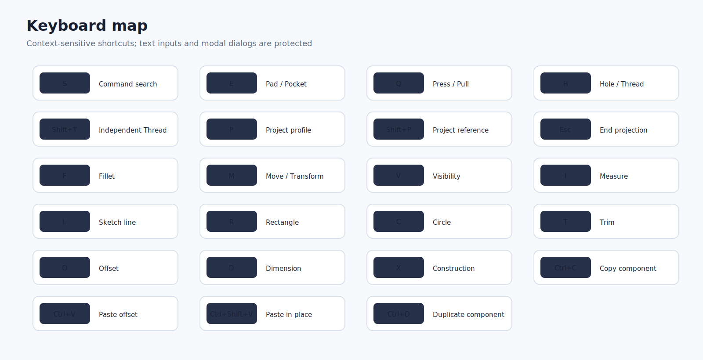

# Graphical user guide

This guide describes the tester-facing behavior of version 1.3.0. The illustrations are conceptual diagrams, not screenshots from a specific FreeCAD theme or operating system.

## Interface orientation

The top workspace selector determines the main ribbon:

- **DESIGN**: solid Part Design, Sketch entry, projection, Hole, Thread, and inspection.
- **ASSEMBLE**: component insertion, copy/paste, grounding, native joints, motion, BOM, and diagnostics.
- **DRAWING**: TechDraw sheets, model views, projected/section/detail views, dimensions, annotations, symbols, BOM, and export.

Sketch edit mode overrides the workspace ribbon temporarily. Leaving the Sketch restores the previously active workspace ribbon.

## Design workspace

### Create

- Body and Sketch creation
- Pad/Pocket under **Extrude**
- Hole and threaded-hole workflow
- Revolution/Groove
- additive/subtractive Loft and Sweep/Pipe
- independent Thread

### Modify

- Fillet, chamfer, draft, and thickness
- Press/Pull approximation using native Pad, Pocket, Thickness, Draft, and Transform commands
- mirror and pattern

### Construct / Inspect

- datum plane, line, point, and coordinate system
- measure, mass properties, geometry check
- fit, isometric, and visibility controls

## Sketch and Project / Include

### Contextual Sketch ribbon

When a `Sketcher::SketchObject` enters edit mode, the profile presents:

- **Finish**: Leave Sketch, Cancel Sketch, View Sketch, Section View, Stop operation
- **Create**: point, line/polyline, rectangle, arc, circle/conic, slot, text, construction geometry
- **Project / Include**: defining projection, reference projection, intersection, Carbon Copy
- **Modify**: trim, split, extend, fillet/chamfer, offset, move, rotate, scale, symmetry, clipboard tools
- **Constrain**: dimension and geometric constraints
- **Inspect**: validation and conflict/redundancy selectors

### Linked defining projection — `P`

Use when the projected result should participate in a closed Pad or Pocket profile.

1. Edit the destination Sketch.
2. Press **P**.
3. Select faces, edges, vertices, or an earlier Sketch.
4. Press **Esc** when finished.
5. Complete the profile and use **E** for Pad/Pocket.

### Linked construction/reference projection — `Shift+P`

Use for persistent design references that should not form the solid profile by themselves.

### Sketch-plane intersection

Creates linked defining curves where the selected geometry intersects the active sketch plane.

### Direct link vs. SubShapeBinder

The runtime links geometry directly when FreeCAD permits the dependency. Imported geometry, cross-Body geometry, and some cross-Part references are routed through a synchronized `PartDesign::SubShapeBinder` inserted before the destination Sketch.

The operation is rejected when it would create a circular dependency, reference a later feature in the same Body, or link directly to another FreeCAD document.

## Hole and Thread

### Native Hole & Thread — `H`

The dialog is a Fusion-style front end over a native `PartDesign::Hole`. It supports installed FreeCAD standards, sizes, classes, depth behavior, direction, modeled/cosmetic thread, counterbore/countersink/counterdrill, drill point, taper, and clearance.

Recommended workflow:

1. Select a Sketch containing points, circles, or arcs, or select an existing Hole.
2. Press **H**.
3. Choose **Hole & Thread**.
4. Set hole type, standard, size, class, direction, depth, and representation.
5. Accept and recompute.

### Independent cylindrical Thread — `Shift+T`

Use on one or more cylindrical faces of the current Body Tip. The result is a persistent `PartDesign::FeaturePython` that can model a helical cut or store cosmetic callout metadata.

- Select cylindrical faces from the same source feature.
- Press **Shift+T**.
- Choose internal/external/automatic recognition, standard, size, class, direction, extent, offset, and clearance.
- Select the Thread feature and press **Shift+T** again to edit it.

Modeled threads increase recompute and file complexity. Cosmetic threads are normally better for large fastener populations.

## Drawing workspace

### Insert Model View

This is the normal engineering-drawing path.

1. Create or select a TechDraw sheet.
2. Click **Insert Model View**.
3. Choose one or more source Bodies, Parts, Links, components, or a native Assembly.
4. Select an existing sheet or create the default sheet.
5. Complete the native base/projected-view task.
6. Select actual drawing edges or vertices on the page.
7. Use Smart Dimension or a specific dimension command.

### Active View Snapshot

This inserts a raster image of the open 3D viewport. It is useful for shaded reference illustrations but does not contain associative model edges or vertices and is not normally dimensionable.

### Dimension selection

The profile warns when:

- nothing is selected
- only a Page or model-tree view item is selected
- the selection is a raster Active View
- no drawing Edge, Vertex, or Face subelement is selected

### Other drawing functions

- projected, section, detail, broken, and clipped views
- hatching and view stacking
- linear, radial, diameter, angular, area, chain, coordinate, and arc dimensions
- centerlines, center marks, thread graphics, leaders, balloons, weld and surface-finish symbols
- thread callouts linked to native Hole or independent Thread features
- Assembly BOM creation and Spreadsheet/BOM placement
- PDF, SVG, and DXF export

## Assembly workspace

### Add and duplicate components

- **Add Selected**: insert selected model objects at their current placement
- **Ctrl+C**: copy selected component sources
- **Ctrl+V**: paste new instances with an X offset
- **Ctrl+Shift+V**: paste in place
- **Ctrl+D**: duplicate selected components with an offset

Instances are normally native `App::Link` objects. Native subassemblies use `Assembly::AssemblyLink` when the build exposes it.

Save both documents before linking components across files. The profile rejects dependency loops and reports skipped sources.

### Grounding

Ground at least one component or establish a grounded path. A fully floating assembly has no reference frame and returns the native solver status for “no grounded component.”

### Connector selection

Choose geometry on two different component instances:

| Joint type | Good connector choices |
|---|---|
| Fixed | faces, edges, vertices, datums, axes, coordinate systems |
| Revolute / cylindrical | cylindrical faces, circular edges, explicit axes |
| Slider | axes, straight edges, planar references, coordinate systems |
| Ball | vertices, centers, point-like references |
| Parallel / perpendicular / angle | planar faces, straight edges, axes, datum planes |
| Distance | point, edge, face, axis, or datum references appropriate to the relation |

### Diagnostic stages

1. **Preflight** checks connector count, component identity, subelement type, obvious geometry mismatch, grounding, and likely closed loops.
2. **Live task panel** updates while the native joint task is open.
3. **Post-solve report** decodes the native solver result and selects a newly failed joint when possible.

Native solver results decoded by the profile:

| Code | Meaning |
|---:|---|
| 0 | solved |
| -6 | no grounded component |
| -4 | over-constrained |
| -3 | conflicting joints |
| -5 | malformed/broken joint |
| -1 | general solver error |
| -2 | redundant joints |

## Timeline and command search

### Parametric timeline

The bottom timeline visualizes compatible document objects in document order. Right-click a compatible Part Design feature to set the Body Tip there or restore the latest solid feature. This is a Body-Tip workflow aid, not Fusion’s native timeline engine.

### Command search — `S`

Searches registered FreeCAD `QAction` commands and triggers the selected action. Disabled commands are shown but cannot be run.

## Keyboard map

Shortcuts are ignored while focus is in a text field, spin box, combo box, modal dialog, or unrelated window.

## Restore and recovery

Use **Fusion-like → Restore original FreeCAD interface** to remove profile widgets and restore saved layout/navigation state. Use **Apply / rebuild** to re-enable it.

For errors, open **View → Panels → Report view** and capture all relevant lines prefixed `[Fusion-like UI]`.
